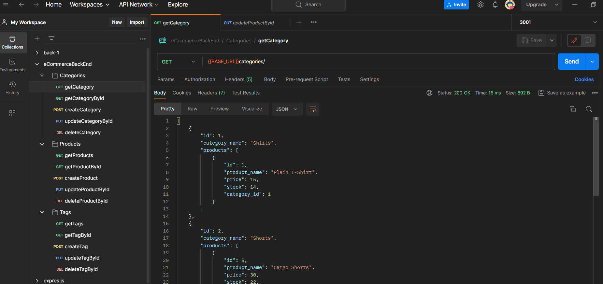

## 💰E-commerce Back End

## Description
📌Back end for an e-commerce site, implemented with Express.js API, Sequelize to interact with a MySQL database.

## Installation
🖇️Installation is no needed.

## Usage
⌨️whole back end code to be ready to use with front end. In Postman tested for GET categories, products, tags as well as GET by ID, POST, PUT, DELETE.

## License
Please refer to the LICENSE in the repo.

## Contributing
🤝Contributors welcome for code improvement.

## EmployeeTracker View

## Questions
If you have any questions find me on [GitHub](https://github.com/oprokopieva382) or feel free email me oprokopieva382@gmail.com

## Links
Check out the walkthrough video [click here](https://drive.google.com/file/d/1YH1Ptm0FYeYC111X7CaPPYTsHKQB4WI9/view)